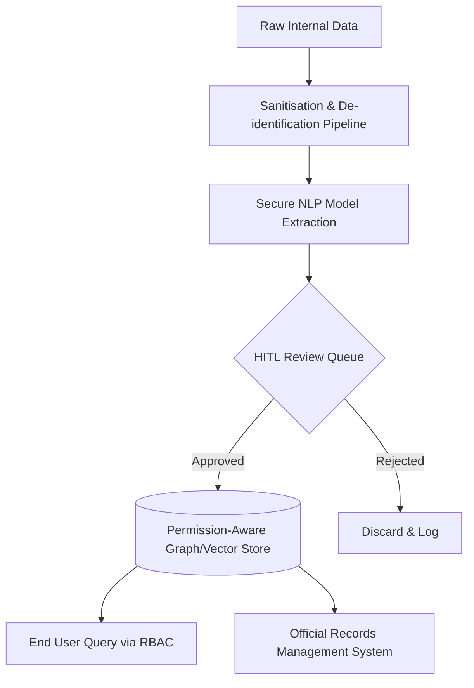

# Appendix — Implementation Plan

The implementation of the Departmental Knowledge Graph requires a phased approach that prioritises legal compliance, privacy, and strict access controls before any data ingestion occurs. The architecture relies on a secure, permission-aware data pipeline to ensure that the highly sensitive nature of internal communications (e.g., emails, meeting minutes) is respected at every layer.

**Sequencing:**
1. **Governance & Legal (Pre-development):** Appoint accountable roles, obtain formal legal advice, and conduct human rights and Indigenous data assessments.
2. **Data Preparation & Privacy (Pre-ingestion):** Implement data minimisation, de-identification pipelines, and apply the National AI Centre's Data Quality Checklist.
3. **Secure Architecture & Development:** Deploy models in a secure zone, implement input sanitisation, and build a permission-aware vector/graph database.
4. **Operational Controls (Deployment):** Establish Human-in-the-Loop (HITL) review queues for sensitive relationships, integrate AI outputs into official recordkeeping, and enable continuous monitoring.

**Architecture at a glance:**


## Implementation steps

### 1. Establish AI governance, legal, and human rights foundations

Before technical development begins, formalise the governance structure. 
1. Designate an Accountable Official and an Accountable Use Case Owner for the Knowledge Graph.
2. Document all relevant legal frameworks, specifically the Privacy Act 1988 (Cth) and Archives Act 1983 (Cth).
3. Obtain formal legal advice regarding the ingestion of internal communications and store this advice in the department's official records management system.
4. Conduct a formal human rights alignment review to assess risks of bias or privacy violations stemming from unstructured data ingestion.

*Answers: [Legal & Administrative Law specialist, §11.1] — Designate an accountable official and an accountable use case owner.; [Legal & Administrative Law specialist, §12.1] — Identify and document relevant legal frameworks including the Privacy Act and Archives Act.; [Legal & Administrative Law specialist, §12.2] — Obtain legal advice regarding compliance and store it in the official records management system.; [Legal & Administrative Law specialist, §10.2] — Conduct a formal human rights alignment review or consultation.*

### 2. Implement privacy-preserving data minimisation and de-identification

To comply with APP 3 and APP 6, raw email archives and wikis cannot be ingested verbatim if they contain unnecessary personal information. 
- Build a pre-processing pipeline that strips out highly sensitive personal identifiers (e.g., using Named Entity Recognition to mask personal phone numbers, health data, or non-work-related personal chatter in emails) before the data reaches the relationship-extraction model.
- Establish a consent framework or explicit internal policy notice for employees regarding the secondary use of their communications for AI processing.

*Answers: [Privacy specialist, §7.1] — Implement robust data minimisation, de-identification, and consent frameworks to comply with APP 3 and APP 6.*

### 3. Execute data quality and Indigenous data assessments

Run the source datasets through the National AI Centre's Data Quality Checklist. 
- **Scripting/Tooling:** Implement automated checks for data completeness, uniqueness (deduplication of email threads), and lineage (tagging every extracted node with its exact source document ID).
- **Indigenous Data:** Audit the data sources for content relating to Aboriginal and Torres Strait Islander people or policies. If found, pause ingestion to partner with Indigenous representatives for co-design and to manage Indigenous Cultural and Intellectual Property (ICIP) risks.

*Answers: [Data Governance specialist, §6.1] — Apply the National AI Centre's Data Quality Checklist (accuracy, completeness, consistency, timeliness, uniqueness, coverage, bias, traceability).; [Data Governance specialist, §6.2] — Assess for Indigenous data and embed co-design and ICIP risk management if present.*

### 4. Secure the AI supply chain and model infrastructure

Ensure the NLP models used for entity and relationship extraction are secure.
- Store all code, configurations, and model weights in a strict version control system with branch protection.
- If using pre-trained open-source NLP models (e.g., for NER or relationship extraction), download and inspect them in an isolated, secure development zone to scan for malware or tampering before deploying to the production environment.

*Answers: [IT Security specialist, §7.3] — Store artifacts in version control and inspect imported pre-trained models in a secure development zone.*

### 5. Build a permission-aware data pipeline and vector store

Because the system connects siloed data, the database must enforce existing access boundaries.
- **Sanitisation:** Apply input validation to all unstructured text to prevent prompt injection or data poisoning.
- **Access Control:** Use a permission-aware graph or vector database. Every extracted edge/node must inherit the Access Control List (ACL) of its source document.

*Example configuration logic:*
```json
{
  "node_id": "project_alpha",
  "extracted_from": "doc_773",
  "required_clearance": "level_2",
  "allowed_groups": ["policy_team_a", "exec_leadership"]
}
```
Queries to the graph must append the current user's group memberships to filter out nodes/edges they are not authorised to see.

*Answers: [IT Security specialist, §7.3] — Apply robust validation/sanitisation protocols and implement permission-aware vector and embedding stores.*

### 6. Implement Human-in-the-Loop (HITL) and automated rollback

Do not allow the AI to autonomously publish sensitive relationships to the live graph.
- **HITL Queue:** Configure the NLP pipeline with a confidence threshold and a sensitivity classifier. If a relationship involves sensitive personnel matters or low-confidence extractions, route it to a human data steward for approval.
- **Rollback:** Implement automated snapshotting of the graph database state. Create a one-click rollback script to revert the graph to the last known good state if data poisoning or systemic extraction errors are detected.

*Answers: [IT Security specialist, §6.7] — Configure the AI to flag risky actions/sensitive relationships for human approval and prepare automated rollbacks.*

### 7. Establish Commonwealth recordkeeping for AI outputs and system design

Treat the AI system's outputs and configurations as official Commonwealth records.
- Configure an automated export job that captures AI-generated nodes, edges, relationship maps, and their metadata, and ingests them into the department's approved records management system (e.g., Content Manager/TRIM).
- Document and retain all records of the system's design, model architecture, rules framework, training datasets, and usage policies in the same records system.

*Answers: [Data Governance specialist, §8.3] — Capture AI-generated outputs/metadata into an approved records management system and retain records of system design and configuration.*

### 8. Configure continuous monitoring, logging, and incident response

Ensure the system's ongoing operation is secure and auditable.
- **Logging:** Log all AI inputs (source text chunks), outputs (extracted entities), and end-user queries. Forward these logs to the department's SIEM for anomaly detection.
- **Incident Response:** Update the department's Business Continuity Plan (BCP) and Incident Response plan to include specific procedures for bypassing or safely disengaging the Knowledge Graph if it is compromised or begins hallucinating relationships.

*Answers: [IT Security specialist, §7.3] — Implement continuous monitoring of model behavior and comprehensive logging of all AI decisions, inputs, and outputs.; [IT Security specialist, §6.7] — Integrate new failure states and procedures for bypassing/disengaging the AI into incident response and BCP.*
