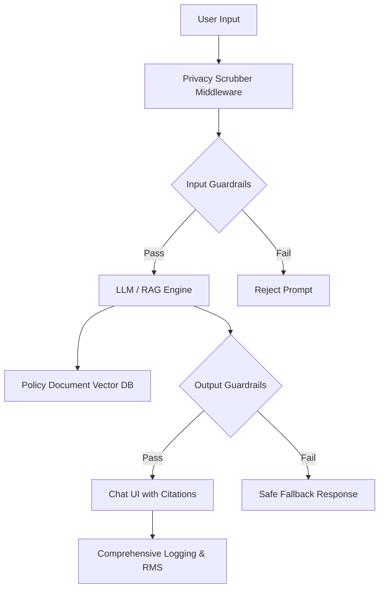

# Appendix — Implementation Plan

The implementation of the ATO Deduction Assistant follows a highly precautionary, phased approach to safely introduce a public-facing generative AI interface into a sensitive domain. The architecture relies on a Retrieval-Augmented Generation (RAG) pattern strictly bounded to official ATO policy documents, completely isolated from live taxpayer data. 



The sequencing begins with establishing governance, legal clearances, and fairness metrics (Phase 1). This is followed by data preparation, mapping policy documents, and building the core RAG and privacy-scrubbing architecture (Phase 2). Phase 3 focuses on rigorous security implementation, including bounded UI controls, kill-switches, and extensive red-teaming. Finally, Phase 4 covers deployment, staff training, and the activation of continuous monitoring frameworks to ensure ongoing compliance and safety.

## Implementation steps

### 1. Establish multidisciplinary governance and accountability

Appoint an Accountable Official and an Accountable Use Case Owner for the system. Assemble a multidisciplinary project team comprising policy owners, legal experts, tax specialists, and user experience designers to oversee the design and deployment.

*Answers: [Legal & Administrative Law specialist, §11.1] — Designate an Accountable Official and an Accountable Use Case Owner, and establish clear human oversight protocols.; [Ethics & Fairness specialist, §10.1] — Assemble a multidisciplinary team including policy owners, legal experts, tax specialists, and user experience designers.*

### 2. Obtain legal clearances and conduct Privacy Impact Assessment

Conduct a comprehensive Privacy Impact Assessment (PIA) adopting a privacy-by-design approach. Concurrently, obtain formal legal advice regarding administrative law risks, privacy compliance, and the legal robustness of the system's disclaimers. Consult internal legal teams or the AHRC regarding human rights obligations (non-discrimination and accessibility). Store all formal advice in the ATO's secure corporate document management system (e.g., Content Manager).

*Answers: [Privacy specialist, §7.1] — Complete a comprehensive privacy impact assessment (PIA).; [Legal & Administrative Law specialist, §12.2] — Obtain formal legal advice to assess administrative law risks, privacy compliance, and disclaimer robustness, stored in a secure document management system.; [Legal & Administrative Law specialist, §10.2] — Consult internal legal and policy teams or the AHRC to ensure alignment with human rights obligations.*

### 3. Define fairness metrics and conduct stakeholder consultation

Explicitly define and document what constitutes a fair process and outcome for the chatbot. Establish measurable acceptance criteria and evaluation metrics to detect unwanted bias, specifically ensuring consistent guidance for non-standard employment types (e.g., gig economy workers). Conduct structured consultation processes with primary users (taxpayers) and internal stakeholders (ATO support staff) to gather feedback on these metrics before deployment.

*Answers: [Ethics & Fairness specialist, §5.1] — Explicitly define and document what constitutes a fair process and outcome, ensuring no unfair discrimination for non-standard employment types.; [Ethics & Fairness specialist, §5.2] — Establish clear, measurable acceptance criteria and evaluation metrics to identify and mitigate unwanted bias.; [Ethics & Fairness specialist, §8.1] — Establish structured consultation processes to gather feedback from primary users and internal stakeholders before deployment.*

### 4. Map policy documents and ensure RAG data quality

Document and map the specific legislative provisions and policy documents that the RAG system will interpret. Apply the National AI Centre's Data Quality Checklist to the document repository to verify accuracy against trusted internal sources, completeness of deduction categories, consistency, timeliness for the current financial year, traceability, and sufficient data coverage.

*Answers: [Legal & Administrative Law specialist, §12.1] — Document and map specific legislative provisions and policy documents during the detailed design phase.; [Data Governance specialist, §6.1] — Apply the National AI Centre's Data Quality Checklist to verify accuracy, completeness, consistency, timeliness, traceability, and data coverage.*

### 5. Implement real-time privacy scrubbing and data isolation

Ensure the system architecture is completely isolated from live taxpayer account data. Implement a middleware layer to perform real-time data minimisation on user prompts before they reach the LLM.

```python
import re

def scrub_user_prompt(prompt_text):
    # Mask Tax File Numbers (TFNs)
    tfn_pattern = r'\b\d{3}[- ]?\d{3}[- ]?\d{3}\b'
    scrubbed = re.sub(tfn_pattern, '[REDACTED_TFN]', prompt_text)
    # Additional regex/NLP masking for sensitive financial identifiers goes here
    return scrubbed
```

*Answers: [Privacy specialist, §7.1] — Implement real-time data minimisation techniques, such as automated scrubbing or masking of TFNs and other personal identifiers from user prompts.; [IT Security specialist, §7.3] — Completely isolate the system from live taxpayer account data to maintain security boundaries.*

### 6. Build RAG citation mechanism

Configure the RAG generation pipeline to append exact source citations to every response. The system must provide direct hyperlinks to the official ATO website for the specific policy document used, instructing the user to perform final verification there.

*Answers: [Ethics & Fairness specialist, §8.5] — Implement a RAG-based citation mechanism that cites the exact source and directs users to the official ATO website for final verification.*

### 7. Configure UI, disclaimers, and bounded creativity dial

Integrate the chat interface into the ATO portal. Implement prominent, mandatory disclaimers clarifying the system's advisory nature. Implement the 'creativity' dial, but strictly bound its underlying LLM parameters (e.g., capping the `temperature` and `top_p` values) to prevent unpredictable or hallucinated outputs. Ensure the UI provides a clear, accessible option for users to request a non-AI alternative (e.g., static FAQ wizard).

*Answers: [Ethics & Fairness specialist, §8.4] — Feature prominent, mandatory disclaimers, a 'creativity' dial as a meta-signal, and the ability to request a non-AI alternative.; [IT Security specialist, §7.3] — Strictly bound the 'creativity' dial's parameters to prevent unpredictable outputs.*

### 8. Implement security guardrails and failsafes

Deploy robust input sanitization and output guardrails to detect and block prompt injection and jailbreaking attempts. Implement a 'kill-switch' capability in the ATO portal to quickly disable the chat interface and revert users to a static FAQ wizard or interactive decision tree in the event of a major hallucination or security compromise. Prepare rollback capabilities to revert to the last known good state if a model update fails.

*Answers: [IT Security specialist, §7.3] — Implement robust input sanitization and output guardrails to mitigate prompt injection and jailbreaking vulnerabilities.; [IT Security specialist, §6.7] — Implement protocols for immediate intervention, including a kill-switch capability, failsafe mechanisms to revert to non-AI alternatives, and rollback capabilities.*

### 9. Configure comprehensive logging and records management

Configure comprehensive logging of all user interactions, prompts, and model decisions. Apply strict access controls to these logs to protect user privacy. Capture and retain these records in an approved records management system in accordance with NAA guidance, taking a risk-based approach to retention. Conduct a Business System Assessment Framework (BSAF) assessment. Finally, publish a public record documenting the system's scope, capabilities, limitations, and expected contexts of use.

*Answers: [IT Security specialist, §7.3] — Configure comprehensive logging of all user interactions and model decisions, treated as sensitive data with strict access controls.; [Data Governance specialist, §8.3] — Capture and retain records in an approved records management system, take a risk-based approach to retention, and undertake a BSAF assessment.; [Ethics & Fairness specialist, §8.2] — Maintain a public record or document the system's scope, capabilities, limitations, and expected contexts of use.*

### 10. Conduct red-teaming and RAI acceptance testing

Execute a comprehensive testing plan prior to deployment. Conduct regular offensive security assessments, including AI red-teaming and penetration testing, specifically targeting prompt injection and input attacks. Perform Responsible AI (RAI) acceptance testing to verify that ethical requirements and fairness metrics are met.

*Answers: [IT Security specialist, §7.3] — Conduct regular offensive security assessments, including AI red-teaming and penetration testing.; [Solution Architect (sections), §6.4] — Establish a comprehensive testing plan including robust adversarial testing (red team testing) and Responsible AI (RAI) acceptance testing.*

### 11. Train staff and update incident response procedures

Update existing incident management procedures to reflect AI-specific failure modes. Provide specialized AI ethics training, interactive workshops, and sandpit environments for operators, support staff, and incident responders to ensure they are equipped to manage and oversee the system.

*Answers: [IT Security specialist, §6.7] — Update incident management procedures to reflect AI-specific failure modes and train responders to assess and address AI-related incidents.; [Solution Architect (sections), §6.8] — Provide regular training programs, including specialized AI ethics training and interactive workshops/sandpit environments for operators and support staff.*

### 12. Deploy continuous monitoring and feedback loops

Post-deployment, activate a Continuous RAI Validator to track model drift, data quality, close-domain hallucinations, token usage, latency, and potential security exploits. Establish a structured feedback loop with ATO policy teams to continuously verify RAG accuracy, flag concerns, and trigger manual intervention or model disengagement if necessary.

*Answers: [Solution Architect (sections), §6.6] — Leverage a continuous monitoring framework (Continuous RAI Validator) to track model drift, hallucinations, agent behaviors, token usage, and security exploits.; [IT Security specialist, §6.7] — Establish a structured feedback loop with ATO policy teams to flag concerns and trigger manual intervention or model disengagement.*
