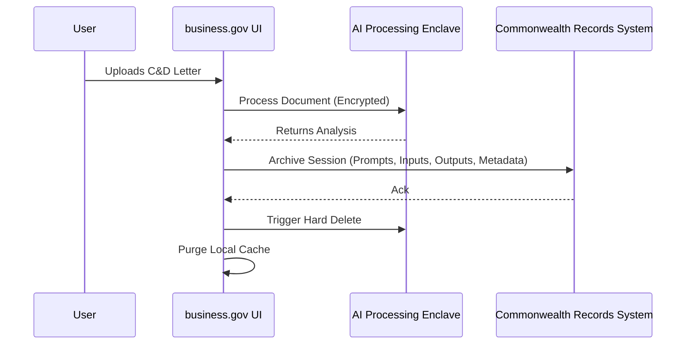

# Appendix — Implementation Plan

The implementation of the C&D Claim Evaluator follows a defense-in-depth architecture, prioritizing strict data compartmentalization, legal accuracy, and user transparency. The system consists of a frontend web interface hosted on business.gov, an API gateway with prompt injection filters, an orchestration layer for document parsing, and an isolated LLM environment.

Sequencing is divided into four phases:
1. **Governance & Legal Prep**: Securing legal advice, mapping legislation, and establishing accountability.
2. **Secure Build**: Procuring the model, implementing strict data handling (balancing privacy destruction with Commonwealth recordkeeping), and building the UI with persistent disclaimers.
3. **Testing & Pilot**: RAI acceptance testing, fault injection, and a restricted pilot deployment.
4. **Production & Monitoring**: Continuous validation, distinct AI logging, and active kill-switch readiness.

## Implementation steps

### 1. Establish governance, legal mapping, and accountability

Before development begins, designate an accountable official and use case owner, and establish a governance board to review the system every 12 months. Report the High-risk use case to the DTA. Conduct a comprehensive legal review to map obligations under the Privacy Act 1988, anti-discrimination laws, and Australian Consumer Law. Obtain formal legal advice to review the AI's programmed legal interpretations, draft robust disclaimers, and ensure compliance. Concurrently, consult human rights and anti-discrimination advisors alongside the Privacy Impact Assessment (PIA).

*Answers: [Legal & Administrative Law specialist, §11.1] — Designate accountable official/owner, report to DTA, and establish 12-month review cycle via governance board; [Legal & Administrative Law specialist, §12.1] — Document relevant legislation including Privacy Act, anti-discrimination laws, and Australian Consumer Law; [Legal & Administrative Law specialist, §12.2] — Obtain legal advice to review AI interpretations, draft disclaimers, and ensure liability compliance; [Legal & Administrative Law specialist, §10.2] — Consult human rights and anti-discrimination advisors alongside the PIA*

### 2. Procure model and verify secondary use prohibitions

Execute an AI Suitability Assessment to evaluate data residency and privacy trade-offs. Inspect any pre-trained or external models in a secure development zone using approved scanners to detect malicious code prior to deployment. Verify contractually and technically that the AI system's terms of use strictly prohibit the developer or third parties from accessing input text for model training or secondary purposes.

*Answers: [Solution Architect (sections), §6.3] — Conduct AI Suitability Assessment evaluating data residency and privacy; [IT Security specialist, §7.3] — Inspect pre-trained models in a secure dev zone using approved scanners; [Privacy specialist, §7.1] — Verify terms of use strictly prohibit input text being used for model training or secondary purposes*

### 3. Develop transparent UI and non-AI alternatives

Build the web-based chat interface on business.gov with a persistent, highly visible disclaimer stating the tool is AI-generated, informational, and not a substitute for professional legal counsel. Configure the AI output to highlight specific paragraphs in the uploaded letter that lack legal basis and provide direct hyperlinks to relevant business.gov guidance articles. Ensure a static, comprehensive 'self-help' guide is published and easily accessible as a non-AI alternative.

*Answers: [Ethics & Fairness specialist, §8.2] — Implement clear, persistent disclaimer that output is informational and not legal counsel; [Ethics & Fairness specialist, §8.4] — Inform users they are interacting with AI and provide a static self-help guide as a non-AI alternative; [Ethics & Fairness specialist, §8.5] — Highlight specific paragraphs in the upload and link to business.gov guidance articles for explanation*

### 4. Implement secure data handling and compliant recordkeeping

To satisfy both privacy destruction requirements and Commonwealth recordkeeping obligations, implement a dual-path data lifecycle. 

Ensure all data is encrypted at rest and in transit. Immediately upon session termination, transfer the AI-generated outputs, metadata, prompts, and inputs to an approved, access-controlled records management system, then securely delete all traces from the active web and AI processing environments.

*Answers: [Privacy specialist, §7.1] — Encrypt data, implement secure access controls, and destroy/de-identify personal info immediately after session ends; [Data Governance specialist, §8.3] — Capture AI outputs, metadata, prompts, and inputs into an approved records management system*

### 5. Deploy security controls, prompt defenses, and kill-switch

Implement input validation and system prompt guardrails to mitigate direct and indirect prompt injection vulnerabilities from uploaded documents. Build a manual kill-switch accessible to the business.gov operations team to immediately take the chatbot offline if it generates harmful advice. Integrate this kill-switch and automated rollback procedures into existing incident response and disaster recovery plans.

*Answers: [IT Security specialist, §7.3] — Address direct and indirect prompt injection vulnerabilities; [IT Security specialist, §6.7] — Implement manual kill-switch, automated rollbacks, and integrate into incident response plans*

### 6. Execute RAI acceptance testing and data quality validation

Prior to deployment, execute a rigorous testing regime. Conduct Responsible AI (RAI) Acceptance Testing to verify the accuracy of the legal analysis. Perform negative testing, failure testing, and fault injection to identify document parsing vulnerabilities. Validate data quality by ensuring the system accurately parses PDFs, covers diverse legal scenarios and language styles to prevent bias, and maintains traceability of which data source influenced specific outputs.

*Answers: [Solution Architect (sections), §6.4] — Conduct RAI Acceptance Testing, negative testing, failure testing, and fault injection; [Data Governance specialist, §6.1] — Ensure data accuracy, completeness, bias coverage, and traceability*

### 7. Train operators and execute restricted pilot

Develop and deliver formal training for business.gov operators and the legal team on how to supervise the system, monitor outputs, and trigger the kill-switch. Following training, launch the system in a structured pilot phase to a restricted audience. Use this pilot to refine model accuracy, test the effectiveness of the UI disclaimers, and validate data handling controls before full public release.

*Answers: [Solution Architect (sections), §6.8] — Establish formal training for operators and legal team to supervise and intervene; [Solution Architect (sections), §6.5] — Conduct a structured pilot phase before full public deployment*

### 8. Implement continuous monitoring and distinct AI logging

Deploy a Continuous RAI Validator pattern to monitor the chatbot in production. Configure logging to track AI decisions for compliance and forensic analysis, ensuring the AI's identity is recorded distinctly from user identifiers. Continuously monitor hallucination rates and the accuracy of legal guidance, maintaining disaster recovery and backup processes.

*Answers: [Solution Architect (sections), §6.6] — Establish Continuous RAI Validator, disaster recovery, and monitoring processes; [IT Security specialist, §7.3] — Configure logging to track AI decisions with a distinct AI identity*
